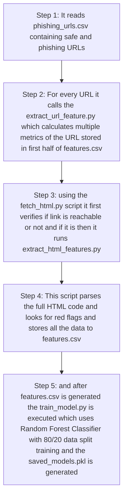
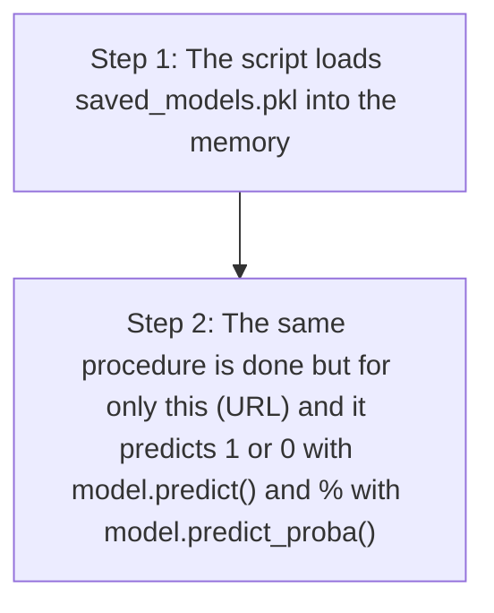

# AI Phishing Detector

This is a AI-powered phishing site detection tool using the Random Forest Classifier model, It not only scans the Suspicious URL but also scans the source code of the URL for any Suspicious forms and gives the result, made as a project for my course "AI essentials in Cybersecurity" in 4th semester

## 🚀 Quick Start (Re-creating from Scratch)

### Prerequisites
*   **Python 3.11+** installed.
*   **Docker** (optional, for containerized run).

### 1. Installation
Clone the repository and navigate to the project folder:
```bash
cd AI-fake-login-page-detector
```

Create a virtual environment:
```bash
python3 -m venv .venv
source .venv/bin/activate  
```
Change to the directory:
```bash
cd ai-phishing-detector
```

Install dependencies:
```bash
pip install -r requirements.txt
```

### 2. Training the Model
You must train the model at least once before using it. This will create the `model/saved_models.pkl` file.

```bash
python3 train.py
```
*Output should show "Model saved to model/saved_models.pkl".*

### 3. Running CLI Detection
To check a specific URL from the command line:

```bash
python3 detect.py "http://google.com"
```

### 4. Running the Web Interface (Optional)
Start the local web server to use the graphical detector:

```bash
python3 web_interface/app.py
```
*Access the tool at: http://localhost:4444*


---

## 🐳 Docker Usage (Easiest Method)

If you don't want to install Python manually do this with docker:

1. **Build the Image** (Run from the project root):
   ```bash
   docker build -t phishing-detector -f ai-phishing-detector/Dockerfile .
   ```

2. **Run the Container**:
   ```bash
   docker run --name phishing-detector -p 4444:4444 -p 8080-8084:8080-8084 phishing-detector
   ```
    *This automatically handles training and starts the website on your localhost 4444.*

## 🛠 Project Structure
*   `data/`: CSV datasets for training.
*   `features/`: Logic for extracting URL and HTML features.
*   `model/`: Training scripts and saved models.
*   `web_interface/`: Flask web application.


## Workflow 

**When you run train.py it generates the proper dataset for training :** 



**when you run detect.py (URL) :**


